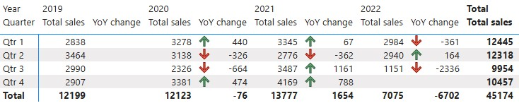
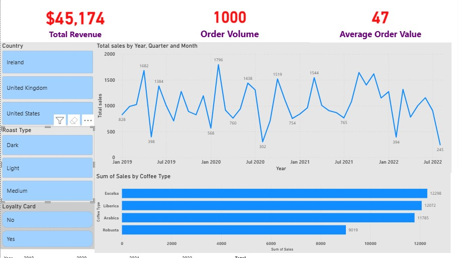

## 📁 Power BI Report File
The complete Power BI report used for this analysis is included in this repository.

**File:** ``

> Open the file using **Power BI Desktop** to interact with the dashboard, view DAX measures, and explore the data model.

# Data Structure
The project uses a relational sales database consisting of three tables: **customers**, **products**, and **orders**.
These tables are connected using unique identifiers to support accurate sales and customer analysis.

  

## Table Descriptions
1. **Customers** - This table contains customer-level information and is used to analyze customer demographics and behavior.
2. **Products** - This table stores product-level details and supports product performance and pricing analysis.
3. **Orders** - This is the fact table containing transactional sales data and links customers to products.

# Executive Summary
From **Q1 2019** to **Q2 2022**, the business generated **$45,174** in **total revenue** from **1,000 orders**, with an **average order size** of **47** units, indicating consistently strong basket sizes across transactions. In the pre-pandemic period (2019), **total sales** reached approximately $12.2K, providing a baseline for performance. During the pandemic period (2020–2021), revenue demonstrated resilience and growth, remaining relatively steady at $12.1K in 2020 and peaking at approximately $13.8K in 2021, representing an estimated **13%** growth from 2019 to 2021. This suggests the business was able to sustain and even expand sales despite broader market disruptions.
For 2022, available data covers only **Q1–Q2**, with recorded sales of about **$7.1K**. When viewed in the context of prior years, this half-year performance represents over **50% of 2021’s full-year revenue**, suggesting a **strong early-year sales trajectory**. While full-year conclusions cannot yet be drawn, the first two quarters indicate continued post-pandemic momentum, with revenue generation tracking ahead of historical mid-year benchmarks.

  

# Insights Deep Dive
## Sales performance 
- Sales exhibit recurring seasonal volatility, indicating demand sensitivity across quarters. Quarterly sales fluctuate consistently across years, with stronger performance typically observed in **Q1** and **Q4**. For example, **Q4 2021** recorded **$4,169**, the highest quarterly sales in the dataset, while Q2 periods tend to underperform. This pattern suggests that sales are influenced by seasonal consumption habits, promotional cycles, or distribution capacity rather than random variation.
- The 2020 sales decline reflects a short-term operational and demand disruption rather than structural weakness. Total sales dipped marginally to **$12,123**, only **$76** lower than 2019, despite quarter-level declines in **Q2 and Q3**. The relatively small annual decline indicates that lost sales were largely offset later in the year, pointing to delayed rather than permanently lost demand.
- 2021 performance highlights improved consistency and stronger revenue capture per quarter. Sales increased to **$13,777**, with positive YoY growth in three out of four quarters. Notably, **Q3 2021 (+$1,161 YoY)** and **Q4 2021 (+$788 YoY)** suggest improved execution, potentially through better inventory availability, pricing discipline, or customer retention, resulting in higher and more stable revenue capture.
- Early 2022 sales indicate continued momentum when benchmarked against historical quarterly performance. Although 2022 includes only **Q1–Q2** data, **Q2 2022** sales **($2,940)** exceeded **Q2 2021 ($2,776)** and remain well above pre-pandemic Q2 levels. When evaluated against historical quarterly averages, early 2022 performance suggests the business was on track to maintain or exceed prior-year run rates.
- Overall, sales performance is driven by a combination of demand recovery, seasonality, and operational stability. Across **Q1 2019–Q2 2022**, total revenue reached **$45,174 from 1,000 orders**, with an **average order value of $47**. While external shocks affected short-term performance, the long-term sales pattern suggests that underlying demand for the product remained strong and capable of rebounding when operational conditions stabilized.

  

## Product performance
- Across the full period (Q1 2019–Q2 2022), all four coffee types, including Excelsa, Liberica, Arabica, and Robusta, contribute meaningfully to total revenue. Excelsa leads overall sales with **$12.3K**, followed closely by Liberica **$12.1K** and Arabica **$11.8K**, while Robusta **$9.0K** trails but still represents a substantial revenue stream. This balanced distribution suggests a diversified product portfolio rather than reliance on a single best-seller.
- Total revenue for Dark roasted coffee stands at approximately $13.2K from 333 orders, yielding an AOV of $40, the lowest among the roast types. Sales volume remains consistent across years, indicating stable demand, but the lower AOV suggests pricing sensitivity or smaller basket sizes. This means that Dark roast is a dependable volume driver rather than a premium revenue contributor.
- The Light roast segment generated approximately $17.4K in revenue from 333 orders, resulting in the highest AOV at $53. Despite having the same order volume, Light roast consistently delivers higher revenue per transaction, indicating a more premium positioning or stronger upsell potential. This suggests Light roast is a key margin-driving segment. Medium roast recorded approximately $14.6K in revenue from 334 orders, with an AOV of $45. This positions it as a stable, core offering within the portfolio as well.
- While all coffee types show recovery post-2020, Light and Medium roasts exhibit stronger upward momentum in later periods, particularly from 2021 onward, whereas Dark roast maintains flatter growth. This divergence suggests that consumer preferences may be gradually shifting toward higher-value or specialty offerings, while traditional products continue to provide baseline stability.
- During periods of sales fluctuation (notably mid-2020), declines are not isolated to a single coffee type, indicating that external factors affected demand broadly. However, the presence of both premium (Light) and volume-driven (Dark) products helped smooth overall revenue volatility, reinforcing the value of a diversified product mix.

  

## Customer insights 
- Customers with a loyalty card generated approximately **$24,240** in revenue from **521 orders**, with an **average order value (AOV) of $49**. In comparison, non-loyalty customers generated **$20,934** from **479** orders, with a lower **AOV of $45**.
- Sales trends for loyalty card holders show more consistent monthly performance, with fewer extreme drops compared to non-loyalty customers. While both groups experience volatility during external disruptions (e.g., mid-2020), loyalty customers recover faster and maintain steadier sales levels afterward. This suggests that repeat customers act as a stabilizing force during periods of uncertainty.
- Non-loyalty customers still account for a significant share of total sales (~46% of total revenue), highlighting the importance of acquisition. However, their purchasing behavior shows sharper peaks and troughs, alongside lower AOV, implying more transactional or occasional purchasing rather than sustained engagement. This reinforces the need to convert first-time buyers into repeat customers.
- Despite relatively similar order volumes between loyalty (521 orders) and non-loyalty (479 orders) customers, loyalty card holders generate ~16% more revenue. This gap suggests that the loyalty program likely encourages higher basket sizes, repeat purchasing, or premium product selection—making it a high-impact lever for revenue growth without proportional increases in customer acquisition costs.

# Recommendations:
- As already established, sales data shows recurring seasonality, with stronger performance in Q1 and Q4 and softer results in Q2 across multiple years. So, we recommend to increase inventory availability and marketing activity ahead of historically strong quarters. Then, for the slower quarters, we recommend targeted promotions or bundle offers to smooth revenue volatility. This approach helps maximize revenue during peak demand while reducing underperformance during slower periods.
- Prioritize Light and Medium roasts in premium placements, upsell campaigns, and bundled offers. Consider modest price optimization or limited-edition variants within these categories to increase revenue per order without relying on volume growth. These products should be positioned as the primary levers for revenue expansion.
- For the dark roast that demonstrated lower AOV of $40 and flatter growth, we do recommend using it to support consistent baseline sales rather than aggressive growth targets. You may also consider cross-sell strategies, such as add-ons or complementary products to lift basket size without risking customer churn. This way, you protect volume while improving overall transaction value.
- Since Loyalty card holders tend to generate ~16% more revenue, higher AOV ($49 vs $45), and more stable sales patterns than non-loyalty customers, introduce clearer incentives for first-time buyers to join the loyalty program. You should also focus on early conversion within the first 1–2 purchases to accelerate customer lifetime value. The goal here is to improve loyalty conversion rates in attempt to standardize revenue growth and reduce volatility.
- Continue acquisition efforts but evaluate success based on conversion to repeat purchase, not just first-sale volume. In addition, align marketing KPIs to reward retention outcomes (repeat rate, AOV growth) rather than acquisition alone. This way, you will ensure growth is sustainable and not overly sensitive to market disruptions.

