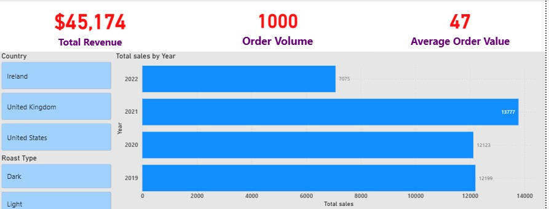

# Data Structure
The project uses a relational sales database consisting of three tables: **customers**, **products**, and **orders**.
These tables are connected using unique identifiers to support accurate sales and customer analysis.

## Table Descriptions
1. **Customers** - This table contains customer-level information and is used to analyze customer demographics and behavior.
2. **Products** - This table stores product-level details and supports product performance and pricing analysis.
3. **Orders** - This is the fact table containing transactional sales data and links customers to products.

# Executive Summary
From **Q1 2019** to **Q2 2022**, the business generated **$45,174** in **total revenue** from **1,000 orders**, with an **average order size** of **47** units, indicating consistently strong basket sizes across transactions. In the pre-pandemic period (2019), **total sales** reached approximately $12.2K, providing a baseline for performance. During the pandemic period (2020–2021), revenue demonstrated resilience and growth, remaining relatively steady at $12.1K in 2020 and peaking at approximately $13.8K in 2021, representing an estimated **13%** growth from 2019 to 2021. This suggests the business was able to sustain and even expand sales despite broader market disruptions.
For 2022, available data covers only **Q1–Q2**, with recorded sales of about **$7.1K**. When viewed in the context of prior years, this half-year performance represents over **50% of 2021’s full-year revenue**, suggesting a **strong early-year sales trajectory**. While full-year conclusions cannot yet be drawn, the first two quarters indicate continued post-pandemic momentum, with revenue generation tracking ahead of historical mid-year benchmarks.

# Insights Deep Dive
## Sales performance 
- Sales showed strong resilience and recovery post-pandemic, with 2021 emerging as the best-performing year. Total sales increased from **$12,199** in **2019** to **$13,777**, representing a **~13%** growth despite disruptions during the COVID-19 period (2020). While 2020 sales dipped slightly to **$12,123**, the rapid rebound in 2021 indicates strong demand recovery and effective sales continuity post-pandemic.
- The pandemic impact is clearly visible in mid-2020, followed by a sustained upward trend. **Sales volatility** peaked during **Q2–Q3**, with sharp monthly drops (e.g., **June 2020** at **$302**, down from **$1,384 in June 2019**). However, from **Q4 2020** onwards, sales began stabilizing and rising, signaling a recovery phase that carried into 2021 with consistently higher monthly totals.
- Although **2022 total sales ($7,075)** appear significantly lower than prior years, this reflects only two quarters of data **(Q1–Q2)**. When viewed on a monthly basis, early-2022 sales remain broadly aligned with late-2021 performance, indicating continued sales momentum rather than decline. This suggests that, if trends continued, full-year 2022 sales were likely on track to be competitive with prior years.

![Sales performance YoY](

